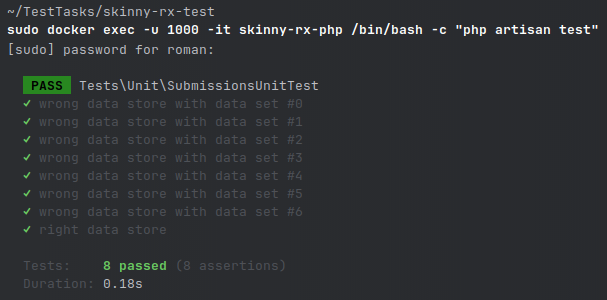

# SkinnyRX Test Task

## Requirements

- Docker
- Unix OS (Linux preferably; MacOS X) or Windows with DockerHub

## Setup

To start running this project on Your local machine, You should:

- Clone this project using Git (GUI, console etc.) onto Your computer
- Add host into a hosts file at location of:
    - `/etc/hosts` (Linux; MacOS X)
    - `%SystemRoot%\system32\drivers\etc\hosts` (Windows)

```shell
::1 skinny-rx.local
```

`::1 skinny-rx.local` template will make You able to test this API on local network

Afterward, You would need to run next command set within the root of Your project:

```shell
cd docker
docker-compose -f docker-compose.local -p skinny-rx-test up -d
``` 

This script will download needed Docker images and set it up on Your machine.   
You might have Docker system-wide, which might require `sudo` commands to be inserted before `docker-compose` command.  
If rootless - no `sudo` prefix is required.

Install composer dependencies for the project (might need to prefix with `sudo`):

```shell
docker exec -u 1000 -it skinny-rx-php /bin/bash -c "cp .env.example env; composer i -q -n; php artisan key:generate; php artisan migrate"
```

## Testing

Via Postman or CURL You can send a POST request to an endpoint - `https://skinny-rx.local/api/v1/submissions` (https is
allowed by Caddy2 server; self-signed certificate).     
Payload is next:

```markdown
Request Schema:
name - string
email - string
message - string
```

```json
{
    "name": "John Doe",
    "email": "john.doe@email.me",
    "message": "Submission message"
}
```

On any missing fulfilling requirements - You will be getting an HTTP error (422 Unprocessable Entity):

```json
{
    "success": false,
    "data": null,
    "error": [
        "The email field must be a valid email address.",
        "The message field is required."
    ],
    "message": "Error has been occurred"
}
```

On the other hand, on success:

```json
{
    "success": true,
    "data": {
        "submission": true
    },
    "errors": null,
    "message": "OK"
}
```

To be able to have more concrete notifications system to the end-user - Centrifuge, Pusher, Laravel Reverb, Laravel Echo, APN, GCM,
Websockets (Socket.io), Mercury.io can be utilized. 

To run tests You have to execute:
```shell
docker exec -u 1000 -it skinny-rx-php /bin/bash -c "php artisan test"
```
After an execution You should see the results:  

